# Цель работы
1. Развить практические навыки использования языка программирования R для обработки данных.
2. Закрепить знания базовых типов данных языка R.
3. Развить пркатические навыки использования функций обработки данных пакета dplyr – функции
select(), filter(), mutate(), arrange(), group_by().

# Исходные данные
1. RStudio.

# План
1. Познакомиться с базовыми типами данных в языке R.
2. Выполнить задания.
3. Оформить отчет.

# Описание шагов
1. Установливаем библиотеку dplyr

```R
install.packages("dplyr")
```

```R
library(dplyr)
```
1. Загружаем пакет dplyr и загружаем датафрейм starwars

```R
library(dplyr)
data(starwars)
```
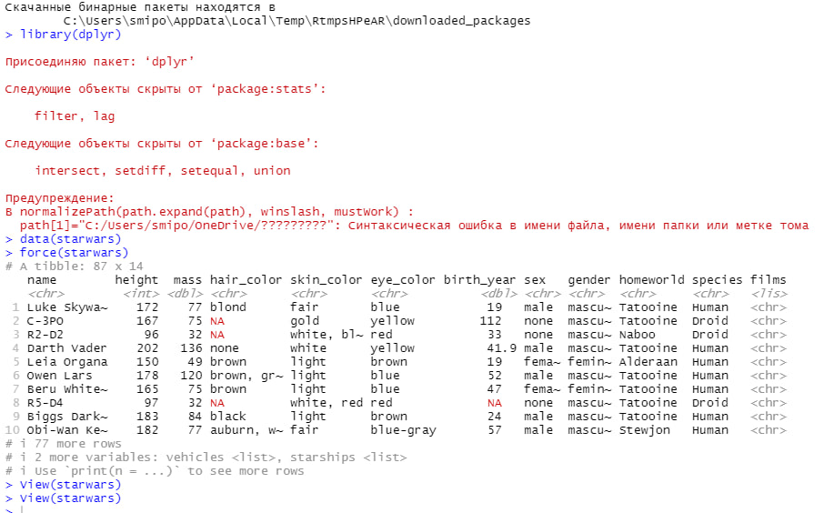
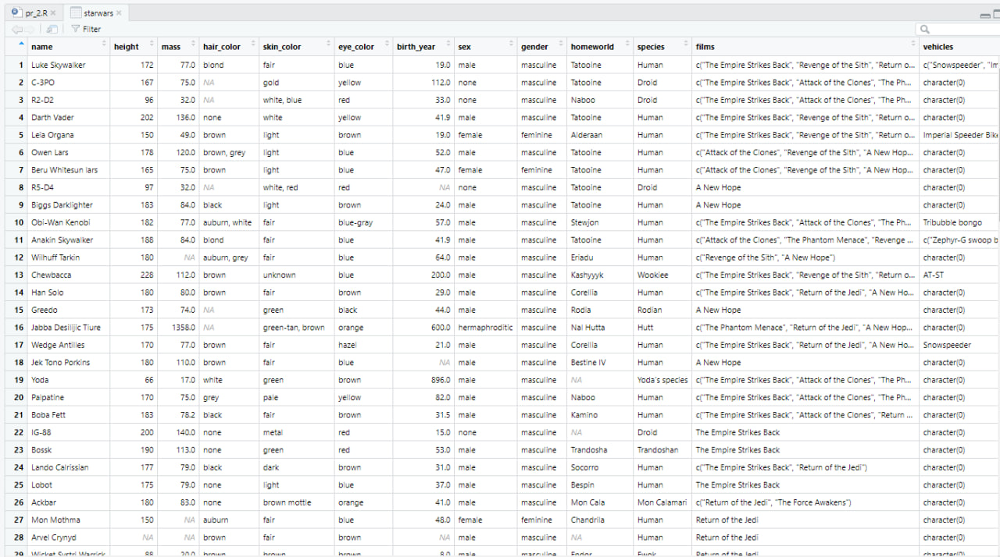

1. Выполнение заданий

* Сколько строк в датафрейме?

```R
number_of_rows <- starwars %>% nrow()
number_of_rows
```

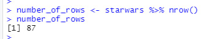

* Сколько столбцов в датафрейме?

```R
number_of_columns<- starwars %>% ncol()
number_of_columns
```

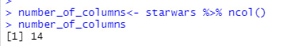

* Как просмотреть примерный вид датафрейма?

```R
df <- starwars %>% glimpse()
df
```

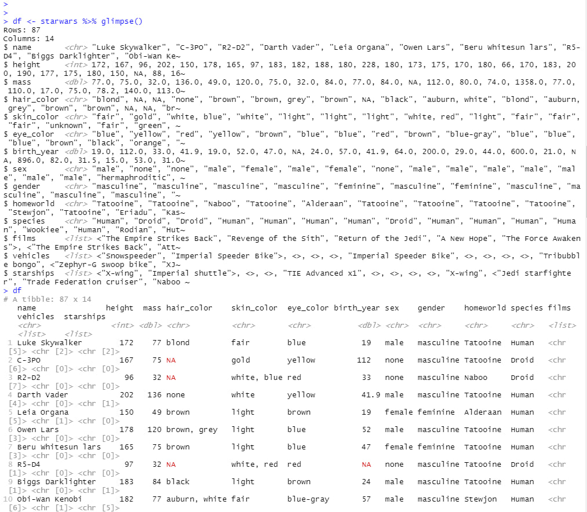

* Сколько уникальных рас персонажей (species) представлено в данных?

```R
uniq_number_of_race <- starwars %>%
                       select(species) %>%
                       distinct() %>%
                       nrow()
uniq_number_of_race
```


* Найти самого высокого персонажа.

```R
height_character <- starwars %>%
                    filter(height == max(height, na.rm = TRUE))
height_character
```

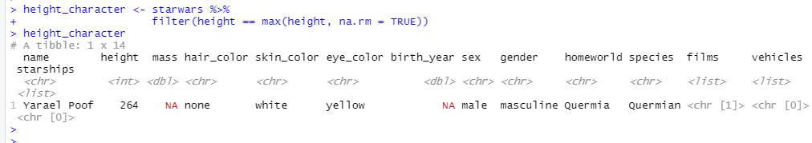

* Найти всех персонажей ниже 170.

```R
under_num <- starwars %>%
             filter(height < 170)
under_num
```

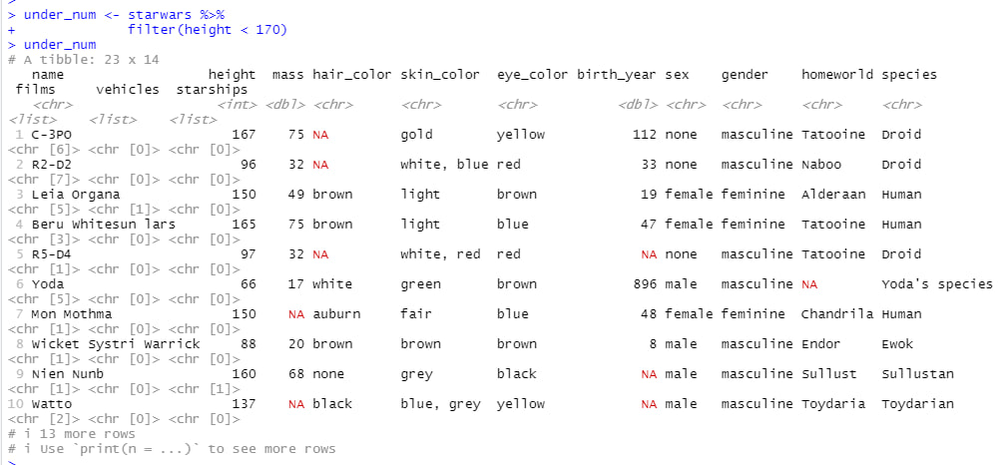

* Подсчитать ИМТ (индекс массы тела) для всех персонажей. ИМТ подсчитать по формуле 𝐼 = 𝑚
ℎ2 , где 𝑚 – масса (weight), а ℎ – рост (height).

```R
bmi <- starwars %>%
       mutate(BMI = mass / ((height/100)^2))
bmi
```

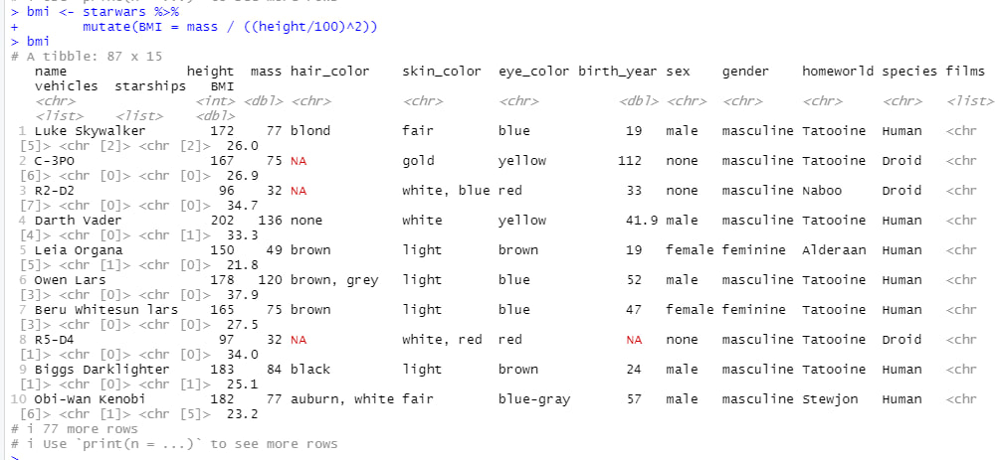


* Найти 10 самых “вытянутых” персонажей. “Вытянутость” оценить по отношению массы (mass) к росту
(height) персонажей.

```R
top_10_elongated <- starwars %>%
                    mutate(elongation = mass / height) %>%
                    arrange(desc(elongation)) %>%
                    head(10)
top_10_elongated
```

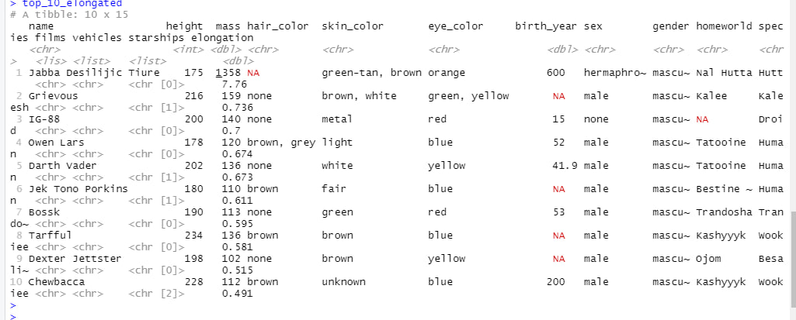

* Найти средний возраст персонажей каждой расы вселенной Звездных войн.

```R
avg_age <- starwars %>%
           group_by(species) %>%
           summarise(average_age = mean(birth_year, na.rm = TRUE))
avg_age
```

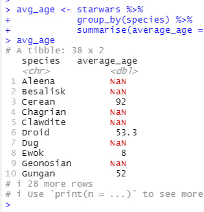

* Найти самый распространенный цвет глаз персонажей вселенной Звездных войн.

```R
widespread_eye_color <- starwars %>%
                        count(eye_color) %>%
                        filter(n == max(n))
widespread_eye_color
```


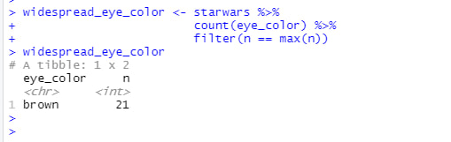

* Подсчитать среднюю длину имени в каждой расе вселенной Звездных войн.

```R
avg_name_len_by_race <- starwars %>%
                        group_by(species) %>%
                        summarise(average_name_len = mean(nchar(name)))
avg_name_len_by_race
```


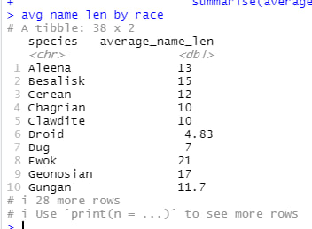

# Вывод
Развил практические навыки использования языка R для обработки данных, приобрел навыки использования функций обработки данных пакета dplyr.